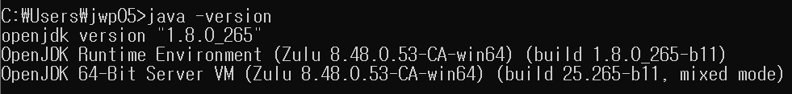
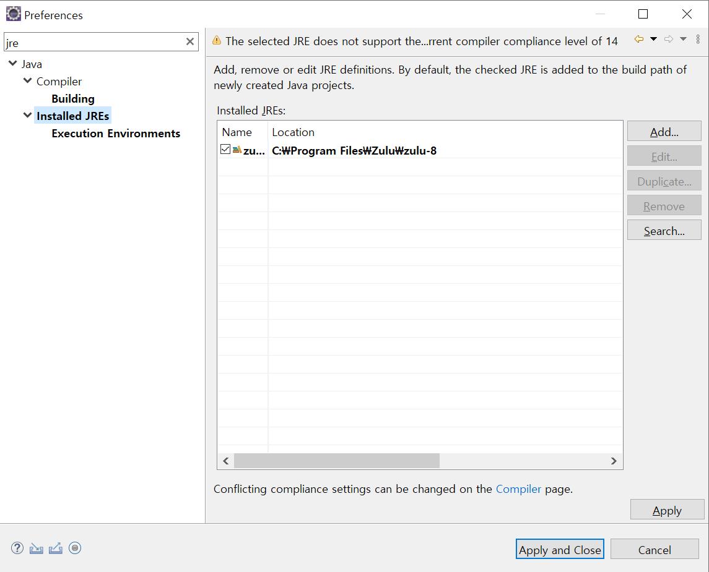
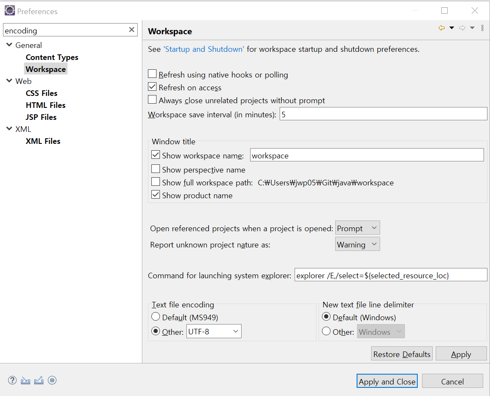
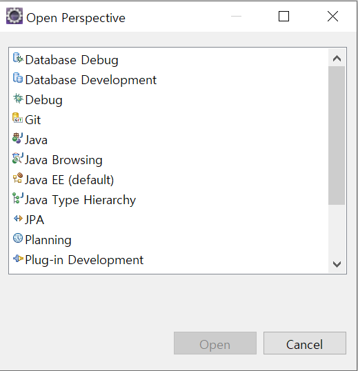
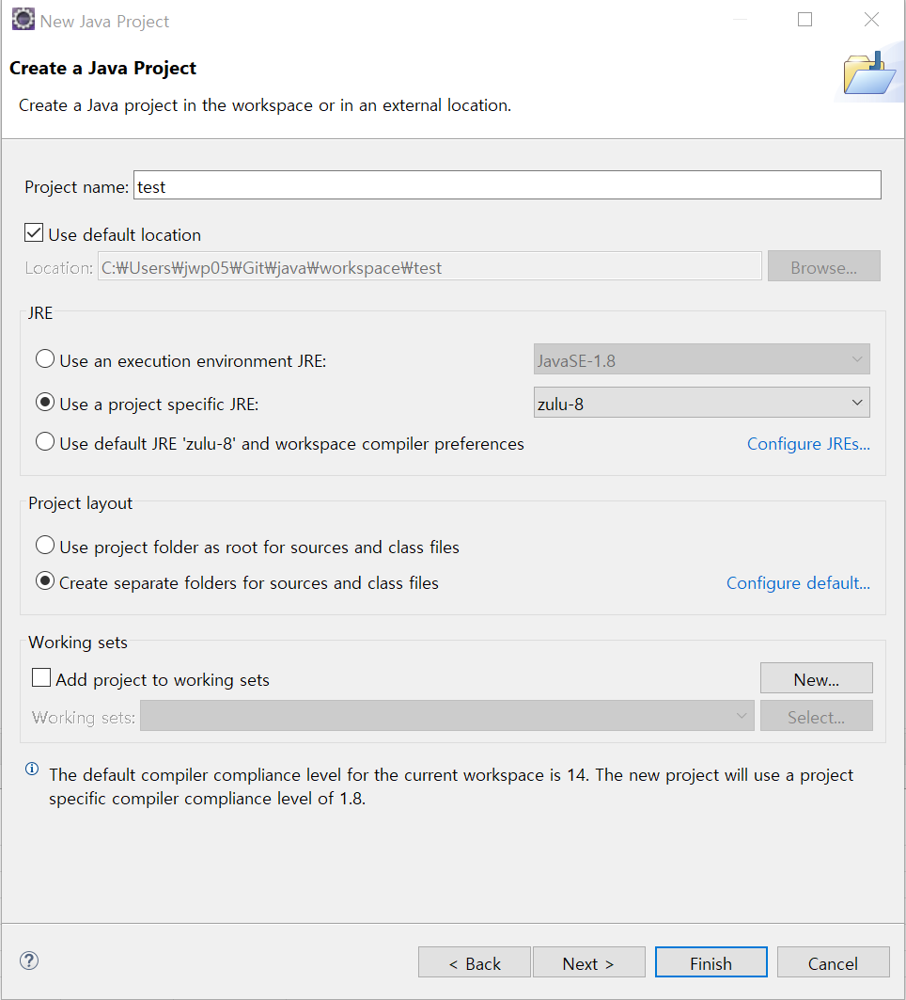
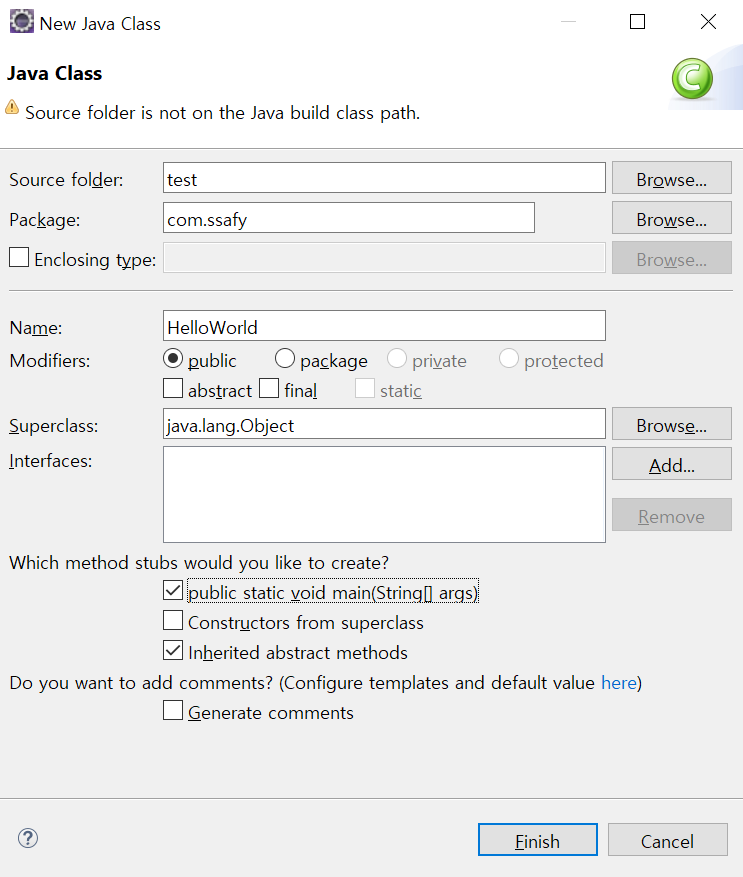
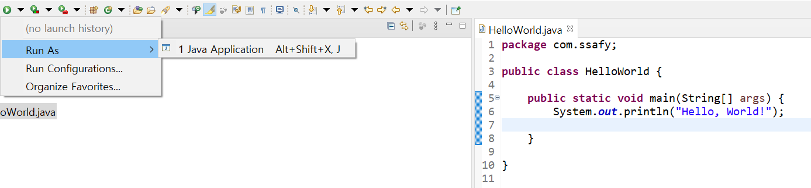

# Java

## Intro

### Write Once, Run Anywhere(Everywhere)

**Write Once, Run Anywhere**(WORA) 또는 **Write Once, Run Everywhere**(WORE)는 썬 마이크로시스템즈에 의해 만들어진 자바의 크로스/플랫폼에 의한 이익을 표현하기 위한 표어이다. 이상적으로, 이것은 자바가 어떤 장비에서도 개발될 수 있고, 표준 **바이트코드**로 컴파일되고, **자바 가상 머신(JVM)**이 장착된 어떤 장비에서도 실행될 수 있음을 의미한다. 자바 가상 머신 또는 칩, 장비 또는 소프트웨어 패키지에서의 자바 인터프리터의 설치는 산업 표준안이 되었다.

## Installation (Windows 10)

### Zulu Open JDK

[Download](https://www.azul.com/downloads/zulu-community/) Zulu Open JDK.(.msi file)

cmd 창에서 `java -version`를 통해 설치 확인

### Eclipse

[Downloa](https://www.eclipse.org/downloads/packages/release/mars/r/eclipse-ide-java-ee-developers) Eclipse IDE for Java EE Developers.

#### Settings

WIndow -> Preferences에서 Installed JREs에 Standard VM으로 설치한 Zulu의 경로를 추가한다.

encoding을 전부 UTF-8로 변경

우측 상단의 Open Perspective 아이콘을 통해 원하는 Perspective로 변경

New Project 생성

New Class 생성

Run을 통해서 기본적인 출력 확인

