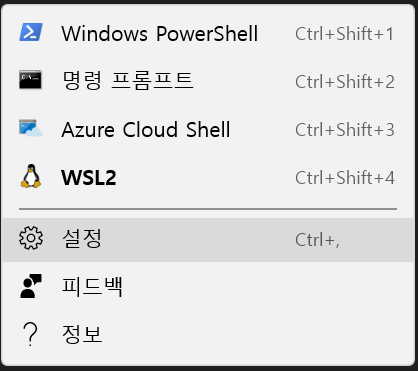

# WSL

> Windows Subsystem for Linux


## WSL1 Installation & WSL2 Update

Open PowerShell as Administrator and run

```powershell
dism.exe /online /enable-feature /featurename:Microsoft-Windows-Subsystem-Linux /all /norestart
```


Restart and open PowerShell as Administrator and run

```powershell
dism.exe /online /enable-feature /featurename:VirtualMachinePlatform /all /norestart
```


Open PowerShell as Administrator and run

```powershell
wsl --set-default-version 2
```


Restart and download linux at Microsoft Store

- [Ubuntu 16.04 LTS](https://www.microsoft.com/store/apps/9pjn388hp8c9)
- [Ubuntu 18.04 LTS](https://www.microsoft.com/store/apps/9N9TNGVNDL3Q)
- [Ubuntu 20.04 LTS](https://www.microsoft.com/store/apps/9n6svws3rx71)
- [openSUSE Leap 15.1](https://www.microsoft.com/store/apps/9NJFZK00FGKV)
- [SUSE Linux Enterprise Server 12 SP5](https://www.microsoft.com/store/apps/9MZ3D1TRP8T1)
- [SUSE Linux Enterprise Server 15 SP1](https://www.microsoft.com/store/apps/9PN498VPMF3Z)
- [Kali Linux](https://www.microsoft.com/store/apps/9PKR34TNCV07)
- [Debian GNU/Linux](https://www.microsoft.com/store/apps/9MSVKQC78PK6)
- [Fedora Remix for WSL](https://www.microsoft.com/store/apps/9n6gdm4k2hnc)
- [Pengwin](https://www.microsoft.com/store/apps/9NV1GV1PXZ6P)
- [Pengwin Enterprise](https://www.microsoft.com/store/apps/9N8LP0X93VCP)
- [Alpine WSL](https://www.microsoft.com/store/apps/9p804crf0395)


## Customizing

### Settings.json

VS Code가 깔려있을 때, 터미널에서 설정을 열면 VS Code로 열린다.




윈도우 터미널을 열 때, 기본으로 열리는 창을 WSL2로 바꿔주기 위해서 `defaultProfile`을 수정한다. guid는 `profiles`에서 확인할 수 있다.

```json
{
	"defaultProfile": "{c6eaf9f4-32a7-5fdc-b5cf-066e8a4b1e40}",
}
```


### [Oh My Zsh](https://github.com/ohmyzsh/ohmyzsh)

> zsh framework 

#### [powerlevel10k](https://github.com/romkatv/powerlevel10k)

> zsh theme


### [Color schemes in Windows Terminal](https://docs.microsoft.com/en-us/windows/terminal/customize-settings/color-schemes)

#### [TerminalSplash](https://terminalsplash.com/)

